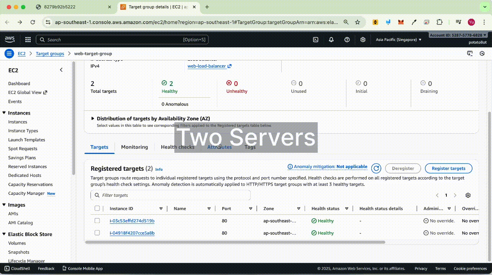
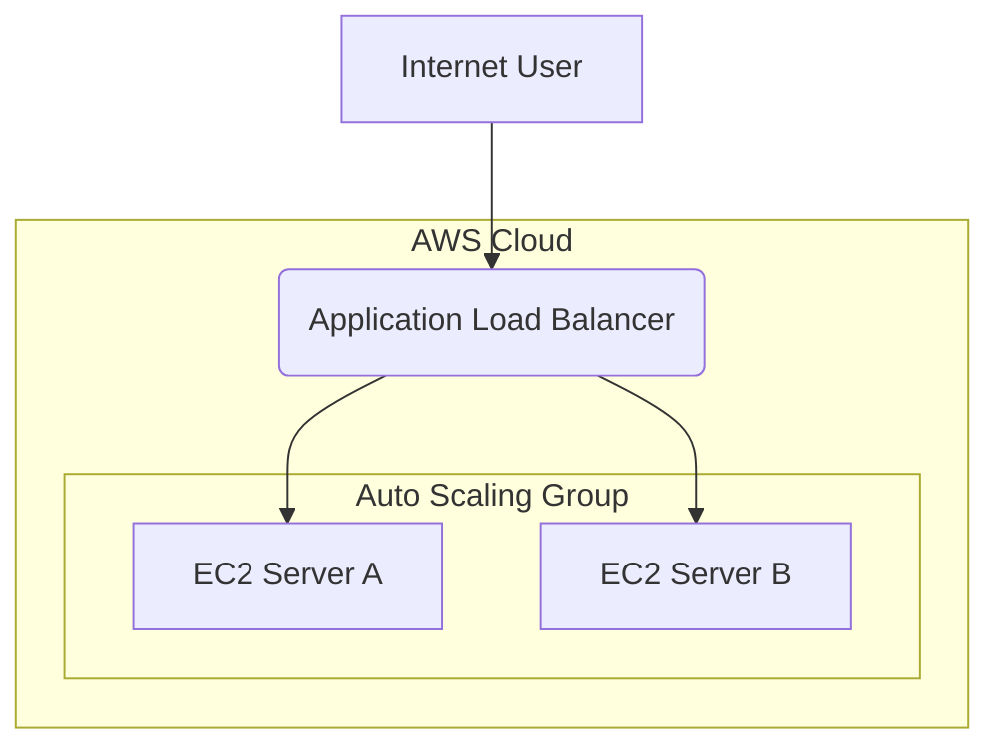

---

# AWS Load‑Balanced Web App (Terraform)

 Terraform creates an ALB and an Auto Scaling Group of EC2 instances running a Dockerised Flask app that shows hostname and basic metrics.



### Key Features

- Application Load Balancer (HTTP)
- Auto Scaling Group (2+ EC2 instances)
- Dockerised Flask app with a dashboard for live performance metrics

### Architecture

The infrastructure consists of a load balancer distributing traffic across two EC2 servers within an Auto Scaling Group.



### Stack
Terraform, AWS (EC2, ALB, Auto Scaling), Docker, Flask

### How to Run

**Prerequisites:** You need an AWS account, AWS CLI, Git, and Terraform installed.

1) Init and deploy
   ```sh
   terraform init
   terraform apply
   ```

2) Open the URL in a browser. Refresh to see requests served by different instances.

3) Clean up
```sh
terraform destroy
```